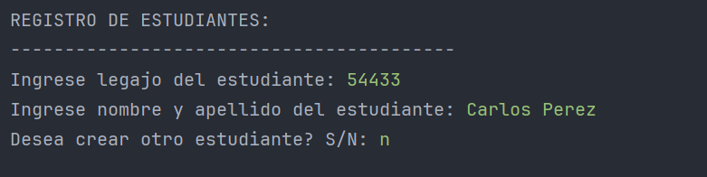
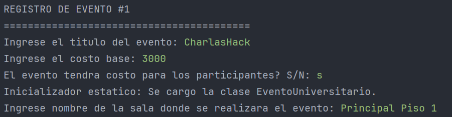
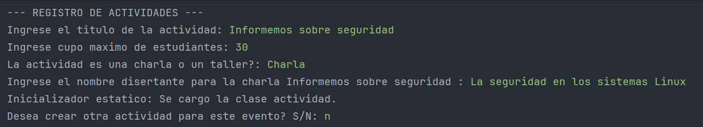
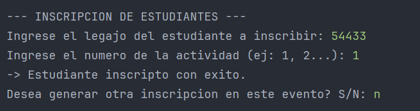
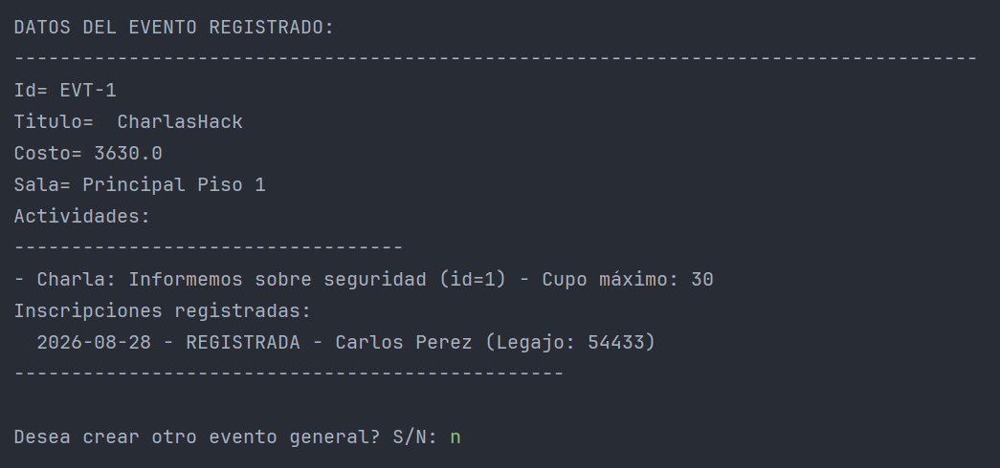
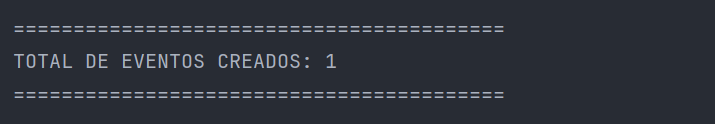

TP1 - Programación Orientada a Objetos en Java

Descripción

Este proyecto implementa un sistema para gestionar eventos universitarios.

El sistema permite:

- Registrar estudiantes.
- Crear eventos universitarios.
- Asignar una sala a cada evento.
- Crear actividades asociadas a los eventos.
- Crear distintos tipos de actividades: `Charla` y `Taller`.
- Inscribir estudiantes en las actividades.
- Consultar las inscripciones realizadas.
- Calcular el costo estimado de un evento.
- Crear copias de eventos mediante un constructor de copia.
- Llevar un contador de la cantidad de eventos creados.

-------------------------------------------------------------------------------------------

Estructura del proyecto

El proyecto está compuesto por las siguientes clases:

- App
- EventoUniversitario
- Sala
- Actividad
- Charla
- Taller
- Estudiante
- Inscripcion

-------------------------------------------------------------------------------------------

Funcionamiento general

El programa comienza ejecutándose desde la clase App, que se encuentra ingresando:
    - Primero a la carpeta "PP_TP1_53388".
    - Luego ingresando a la carpeta "EJERCICIO1-Eventos".
    - Luego a la carpeta "src".

1. Registro de estudiantes

Primero se solicita al usuario la información de los estudiantes:

- Legajo.
- Nombre y apellido.

Cada estudiante se representa mediante un objeto de la clase Estudiante.
Los objetos creados se almacenan en una lista.

2. Registro del evento

Luego se solicita al usuario informar la informacion del evento:
- Titulo.
- Costo base.
- Costo para los participantes.
- Asignacion de sala donde se realiza el evento.

3. Registro de actividades

Luego permite ingresar las actividades del evento, diferenciando si se trata de una "Charla" o de un "Taller".
Asignando a cada caso su correspondiente costo e información.
- Titulo de la actividad.
- Cupo maximo de estudiantes.
- Tipo de actividad (Charla o taller).
    - En el caso de elegir taller, se pregunta si va a ser necesario el uso de NoteBook.
- Nombre de la charla/taller.

4. Inscripción de estudiantes

Se insriben los estudiantes registrados anteriormente que deseen participar del evento, solicitando la siguiente informacion:
- Legajo de estudiante a inscribir.
- Actividad del evento a la que se desea inscribir.

5. Datos del evento registrado

Se muestran los siguientes datos acerca del evento creado:
- Id del evento.
- Titulo.
- Costo.
- Sala asignada.
- Actividades registradas.
    - Nombre de la actividad.
    - Inscripciones registradas.

6. Total eventos creados

El programa finaliza mostrando la cantidad de eventos creados.

